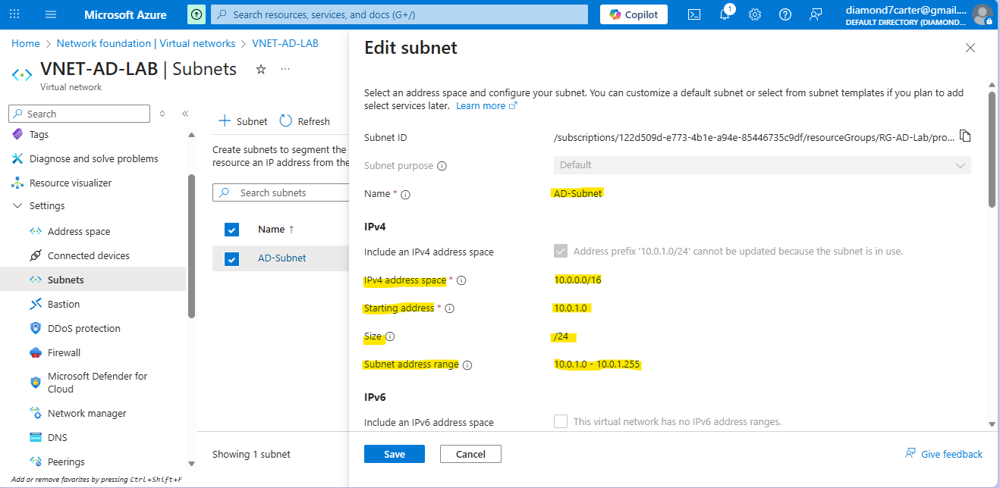
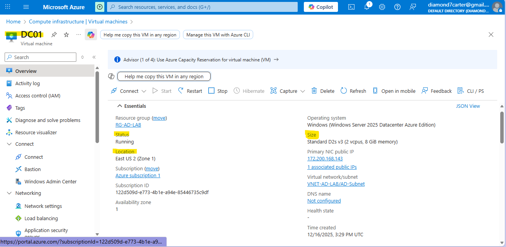
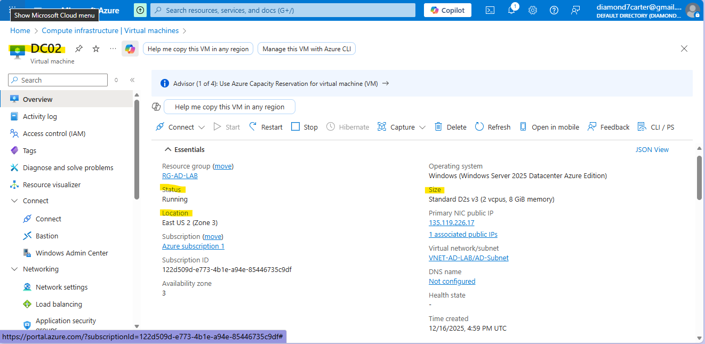

# Azure Active Directory Lab

## Overview
This project documents the deployment of a Windows Active Directory Domain Services (AD DS) environment hosted in Microsoft Azure. The lab simulates a real-world enterprise identity infrastructure using multiple domain controllers and DNS.

The purpose of this lab was to:
- Understand how Active Directory works in practive
- Learn why DNS is critical for practice
- Practice troubleshooting real AD issues
- Build a SOC-relevant lab suitable for Github and resumes

## Objectives
- Deploy Windows Server virtual machines in Azure
- Install and configure Active Directory Domain Services (AD DS)
- Create a new AD forest and domain
- Promote a second domain controller for redundancy
- Configure DNS and validate AD replication
- Create Organizational Units and user accounts

## Architecture
- Azure Resource Group
- Azure Virtual Network & Subnet
- Two Windows Server Domain Controllers
    - DC01 - Primary Domain Controller + DNS
    - DC02 - Secondary Domain Controller (Redundancy)
- AD DS with DNS and Global Catalog enabled
- Multi–Availability Zone deployment

  This setup mirrors how enterprise envirnments ensure availability and resilience for identity services

## Architecture & Azure Resources
Azure Resource Group

Virtual Network & Subnet

Virtual Machines (DC01 & DC02)

## Domain Controller 1 (DC01) Setup
1. Virtual Machine Deployment
   - Deployed Windows Server VM named DC01
   - Assigned static private IP
   - Placed in Azure Virtual Network
WHY:
Domain Controllers require stable IP addresses for DNS and authentication services.

2. Install Active Directory Domain Services (AD DS)
   - Installed AD DS role via Server Manager
   - Accepted required features

3. Promoted DC01 to Domain Controller
   - Created new forest: corp.local
   - Installed DNS Server role
   - Enabled Global Catalog
   - Set DSRM password  
WHY:
This establishes the identity authority for the environment.

## Domain Controller 2 (DC02) Setup
1. Virtual Machine Deployment
   - Deployed Windows Server VM named DC02
   - Placed in same VNet/Subnet
   - Static private IP assigned

2. DNS Configuration (Critical Step)
   DC02 initially could not detect the domain. 

## Key Skills Demonstrated
- Active Directory administration
- Azure VM and networking configuration
- DNS troubleshooting
- Domain controller promotion and replication
- Enterprise identity fundamentals

## Why This Lab Matters
Active Directory is a critical component of enterprise environments and a frequent target during cyber attacks. Understanding how AD is built, replicated, and managed is essential for SOC analysts, blue team members, and IT professionals.

## Documentation
See **Azure_Active_Directory_Lab.pdf** for a full step-by-step breakdown of what was built and why. 
